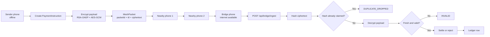
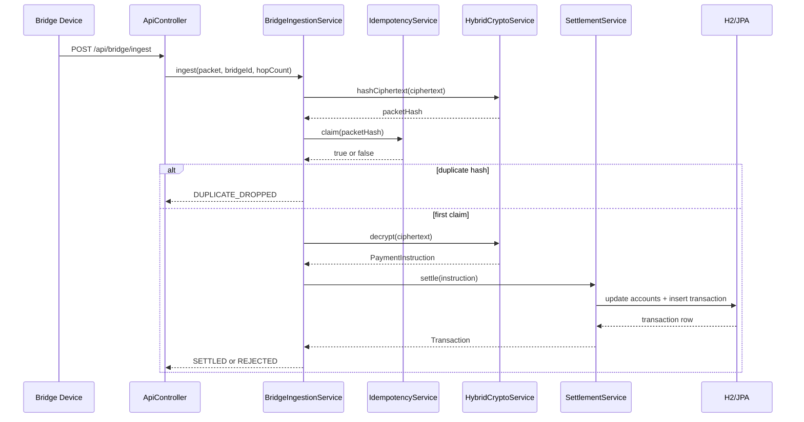
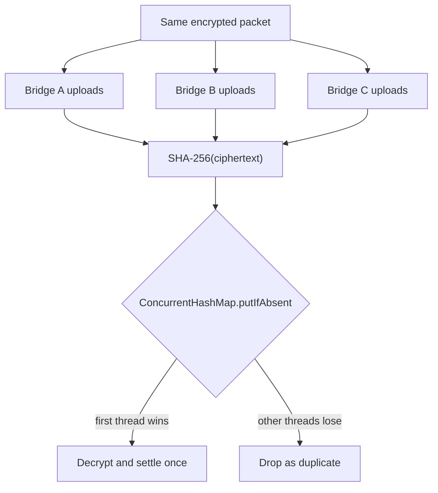
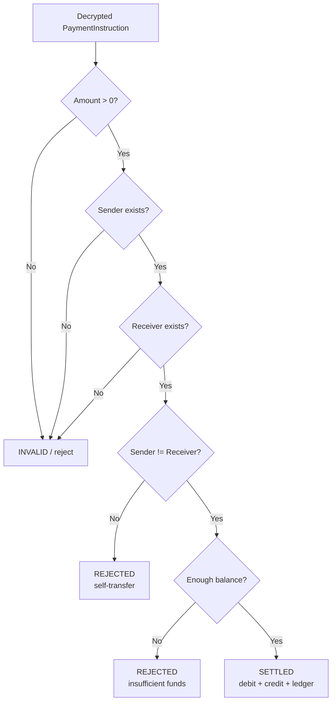

# UPI Offline Mesh

An interactive Spring Boot demo that shows how a UPI-style payment could be created offline, carried through nearby phones, and settled later when one device reaches the internet.

The short version:

1. A sender creates a payment while offline.
2. The payment is encrypted so strangers cannot read or change it.
3. Nearby phones relay the encrypted packet through a simulated Bluetooth mesh.
4. A bridge phone with internet uploads the packet to the backend.
5. The backend deduplicates, decrypts, validates, and settles or rejects the transaction.

This repository is not a production UPI implementation. It is a learning/demo project for the backend, cryptography, idempotency, settlement, and mesh-simulation ideas.

---

## Table of Contents

- [What This Project Demonstrates](#what-this-project-demonstrates)
- [Project Status](#project-status)
- [Tech Stack](#tech-stack)
- [How The System Works](#how-the-system-works)
- [Flow Pictures](#flow-pictures)
- [Interactive Dashboard](#interactive-dashboard)
- [How To Run](#how-to-run)
- [How To Use The Demo](#how-to-use-the-demo)
- [API Reference](#api-reference)
- [Security Model](#security-model)
- [Business Rules](#business-rules)
- [Database Model](#database-model)
- [Project Structure](#project-structure)
- [Tests](#tests)
- [Production Roadmap](#production-roadmap)
- [Limitations](#limitations)
- [Troubleshooting](#troubleshooting)

---

## What This Project Demonstrates

This project proves four core backend ideas:

1. **Untrusted devices can carry a payment without reading it.**
   The payment payload is encrypted with hybrid cryptography: RSA-OAEP protects a one-time AES key, and AES-256-GCM protects the actual JSON payment instruction.

2. **Tampered packets are rejected.**
   AES-GCM authenticates the ciphertext. If any byte is changed, decryption fails and the packet never reaches settlement.

3. **Duplicate bridge uploads settle once.**
   Multiple phones may upload the same packet. The backend hashes the ciphertext and atomically claims that hash before decrypting. Only the first upload proceeds.

4. **Invalid settlement cases are declined.**
   The backend rejects stale packets, insufficient balance, invalid amounts, and self-transfers such as `alice@demo -> alice@demo`.

---

## Project Status

Current implementation includes:

- Spring Boot backend
- REST API
- H2 in-memory database
- Thymeleaf dashboard
- Virtual mesh simulator
- Hybrid encryption service
- Idempotency cache
- Transaction ledger
- Account balance settlement
- Same-person transfer rejection
- Concurrency/idempotency tests

Current demo URL after normal startup:

```text
http://localhost:8080
```

If port `8080` is already busy, run on another port:

```bash
./mvnw spring-boot:run -Dspring-boot.run.arguments=--server.port=8081
```

Then open:

```text
http://localhost:8081
```

---

## Tech Stack

| Area | Technology |
|---|---|
| Language | Java 25 |
| Backend | Spring Boot 3.5.0 |
| Web API | Spring Web |
| UI | Thymeleaf + HTML/CSS/JavaScript |
| Persistence | Spring Data JPA |
| Database | H2 in-memory |
| Crypto | RSA-OAEP + AES-256-GCM |
| JSON | Jackson |
| Build | Maven Wrapper |
| Tests | JUnit + Spring Boot Test |

Important configuration lives in:

```text
src/main/resources/application.properties
```

Key settings:

```properties
server.port=8080
spring.datasource.url=jdbc:h2:mem:upimesh
upi.mesh.idempotency-ttl-seconds=86400
upi.mesh.packet-max-age-seconds=86400
```

---

## How The System Works

### 1. Sender creates a payment

The dashboard calls:

```http
POST /api/demo/send
```

The backend simulates what a real Android sender app would do:

- Build a `PaymentInstruction`
- Add sender VPA
- Add receiver VPA
- Add amount
- Add PIN hash
- Add nonce
- Add signed timestamp
- Encrypt the instruction
- Wrap it in a `MeshPacket`
- Inject it into `phone-alice`

The decrypted payment object looks conceptually like this:

```json
{
  "senderVpa": "alice@demo",
  "receiverVpa": "bob@demo",
  "amount": 500,
  "pinHash": "sha256-of-pin",
  "nonce": "unique-payment-id",
  "signedAt": 1778470000000
}
```

The over-the-wire mesh packet looks like this:

```json
{
  "packetId": "uuid-visible-to-mesh",
  "ttl": 5,
  "createdAt": 1778470000000,
  "ciphertext": "base64-rsa-aes-gcm-payload"
}
```

Intermediary phones can see `packetId`, `ttl`, and `createdAt`, because those are needed for routing. They cannot read the encrypted payment instruction.

### 2. Packet moves through the mesh

The dashboard calls:

```http
POST /api/mesh/gossip
```

`MeshSimulatorService` runs one gossip round:

- Every virtual phone shares held packets.
- Packets are copied to devices that do not already have them.
- TTL decreases on each hop.
- Duplicate packet IDs are ignored by each virtual device.

The default devices are:

```text
phone-alice       offline
phone-stranger1   offline
phone-stranger2   offline
phone-stranger3   offline
phone-bridge      has internet
```

### 3. Bridge uploads to backend

The dashboard calls:

```http
POST /api/mesh/flush
```

This collects packets from devices where `hasInternet=true` and uploads them to the production-style endpoint:

```http
POST /api/bridge/ingest
```

### 4. Backend ingestion pipeline

`BridgeIngestionService` performs the critical pipeline:

1. Hash ciphertext using SHA-256.
2. Claim the hash in `IdempotencyService`.
3. Reject immediately if already claimed.
4. Decrypt the ciphertext with `HybridCryptoService`.
5. Reject if the packet is stale or future-dated.
6. Call `SettlementService`.
7. Return `SETTLED`, `REJECTED`, `DUPLICATE_DROPPED`, or `INVALID`.

### 5. Settlement

`SettlementService` applies business rules:

- Amount must be positive.
- Sender must exist.
- Receiver must exist.
- Sender and receiver must be different.
- Sender must have enough balance.

If valid:

- Debit sender
- Credit receiver
- Write transaction ledger row with status `SETTLED`

If invalid but decryptable:

- Do not move balances
- Write transaction ledger row with status `REJECTED`

---

## Flow Pictures

GitHub renders the diagrams below as visual flow charts.

### End-To-End Payment Flow



### Backend Ingestion Pipeline



### Idempotency Race



### Settlement Decision Tree



---

## Interactive Dashboard

The dashboard is served from:

```text
src/main/resources/templates/dashboard.html
```

It includes:

- Live mesh map
- Virtual phones
- Bridge node indicator
- Packet chips
- Animated mesh transfer lines
- Payment composer
- Account balance table
- Transaction ledger
- Activity log
- Toast notifications
- Live metrics for devices, packets, cache size, and settled rows

Dashboard actions:

| Button | What it does |
|---|---|
| Inject | Creates encrypted packet and injects into `phone-alice` |
| Gossip | Runs one simulated Bluetooth gossip round |
| Bridge | Uploads packets held by internet bridge devices |
| Reset | Clears mesh packets and idempotency cache |

The UI blocks self-transfers immediately. For example, `alice@demo -> alice@demo` shows a decline message and does not inject a packet.

The backend also rejects self-transfers, so direct API callers cannot bypass the UI rule.

---

## How To Run

### Requirements

- JDK 25 installed
- Terminal in the project root
- No external database
- No Maven installation required; the Maven wrapper is included

Check Java:

```bash
java -version
```

### macOS / Linux

```bash
./mvnw spring-boot:run
```

Open:

```text
http://localhost:8080
```

### Windows PowerShell

```powershell
.\mvnw.cmd spring-boot:run
```

Open:

```text
http://localhost:8080
```

### Run On Another Port

If `8080` is busy:

```bash
./mvnw spring-boot:run -Dspring-boot.run.arguments=--server.port=8081
```

Open:

```text
http://localhost:8081
```

### Build JAR

```bash
./mvnw -DskipTests package
```

The JAR is created at:

```text
target/upi-offline-mesh-0.0.1-SNAPSHOT.jar
```

Run the built JAR:

```bash
java -jar target/upi-offline-mesh-0.0.1-SNAPSHOT.jar
```

---

## How To Use The Demo

### Step 1: Start The Server

```bash
./mvnw spring-boot:run
```

Wait until logs show:

```text
Started UpiMeshApplication
```

### Step 2: Open Dashboard

```text
http://localhost:8080
```

### Step 3: Send A Valid Payment

Example:

```text
Sender:   alice@demo
Receiver: bob@demo
Amount:   500
PIN:      1234
```

Click:

```text
Inject
```

Result:

- A packet appears on `phone-alice`.
- No ledger entry exists yet, because the backend has not received the packet.

### Step 4: Run Gossip

Click:

```text
Gossip
```

Result:

- Packet spreads to other virtual phones.
- Bridge node eventually holds the packet.

### Step 5: Bridge Upload

Click:

```text
Bridge
```

Result:

- Bridge uploads packet to backend.
- Backend decrypts and settles.
- Alice balance decreases.
- Bob balance increases.
- Ledger shows `SETTLED`.

### Step 6: Try Self-Transfer

Example:

```text
Sender:   alice@demo
Receiver: alice@demo
Amount:   50
```

Result:

- UI declines it immediately.
- Backend would also reject it if called directly.
- Balances do not change.

### Step 7: Try Insufficient Balance

Example:

```text
Sender:   dave@demo
Receiver: alice@demo
Amount:   9999
```

Result:

- Packet can be created and delivered.
- Backend decrypts it.
- Settlement is rejected.
- Ledger shows `REJECTED`.
- Balances do not change.

---

## API Reference

Base URL:

```text
http://localhost:8080
```

### Dashboard

```http
GET /
```

Serves the interactive UI.

### Get Server Public Key

```http
GET /api/server-key
```

Returns the RSA public key used by simulated sender devices.

Example response:

```json
{
  "publicKey": "base64-public-key",
  "algorithm": "RSA-2048 / OAEP-SHA256",
  "hybridScheme": "RSA-OAEP encrypts an AES-256-GCM session key"
}
```

### Demo Send

```http
POST /api/demo/send
Content-Type: application/json

{
  "senderVpa": "alice@demo",
  "receiverVpa": "bob@demo",
  "amount": 500,
  "pin": "1234",
  "ttl": 5,
  "startDevice": "phone-alice"
}
```

Creates an encrypted packet and injects it into the simulated mesh.

Example response:

```json
{
  "packetId": "0d24fb6b-91c4-4bac-b2fd-904e2c7f1a21",
  "ciphertextPreview": "rQDFP9C8qa6GWz7rOsNpw5D9...",
  "ttl": 5,
  "injectedAt": "phone-alice"
}
```

### Mesh State

```http
GET /api/mesh/state
```

Returns all virtual devices and packet counts.

### Run Gossip

```http
POST /api/mesh/gossip
```

Runs one mesh gossip round.

### Flush Bridge Uploads

```http
POST /api/mesh/flush
```

Uploads packets from bridge devices to the backend.

Possible outcomes:

| Outcome | Meaning |
|---|---|
| `SETTLED` | Payment accepted and balances updated |
| `REJECTED` | Decrypted payment was validly formed but failed business rules |
| `DUPLICATE_DROPPED` | Same ciphertext hash was already processed |
| `INVALID` | Packet could not be decrypted or failed freshness checks |

### Reset Mesh

```http
POST /api/mesh/reset
```

Clears virtual packet state and idempotency cache.

### Production-Style Bridge Ingest

```http
POST /api/bridge/ingest
Content-Type: application/json
X-Bridge-Node-Id: phone-bridge-42
X-Hop-Count: 3

{
  "packetId": "550e8400-e29b-41d4-a716-446655440000",
  "ttl": 2,
  "createdAt": 1778470000000,
  "ciphertext": "base64-encoded-ciphertext"
}
```

This is the endpoint a real bridge node would call.

### Accounts

```http
GET /api/accounts
```

### Transactions

```http
GET /api/transactions
```

Returns the latest 20 transactions.

### H2 Console

```text
http://localhost:8080/h2-console
```

Use:

```text
JDBC URL: jdbc:h2:mem:upimesh
Username: sa
Password:
```

Useful SQL:

```sql
SELECT * FROM accounts;
SELECT * FROM transactions;
SELECT * FROM transactions WHERE status = 'REJECTED';
```

---

## Security Model

### Hybrid Encryption

Implemented in:

```text
src/main/java/com/demo/upimesh/crypto/HybridCryptoService.java
```

Wire format before Base64:

```text
[ RSA-encrypted AES key ][ 12-byte IV ][ AES-GCM ciphertext + auth tag ]
```

Why hybrid encryption?

- RSA is good for encrypting small secrets, not large payloads.
- AES-GCM is fast and supports authenticated encryption.
- A fresh AES key is generated for every packet.
- Only the backend private key can unwrap the AES key.

### Tamper Detection

AES-GCM includes an authentication tag. If the ciphertext is modified:

- AES-GCM verification fails.
- Decryption throws.
- Backend returns `INVALID`.
- Ledger is not touched.

### Idempotency

Implemented in:

```text
src/main/java/com/demo/upimesh/service/IdempotencyService.java
```

The backend computes:

```text
SHA-256(ciphertext)
```

Then atomically claims it:

```java
Instant previous = seen.putIfAbsent(packetHash, now);
return previous == null;
```

This acts like Redis:

```text
SET packetHash value NX EX 86400
```

If two bridge nodes upload the same packet at the same time:

- One wins the claim.
- Others are dropped as duplicates.
- Settlement happens once.

### Replay Protection

Each encrypted `PaymentInstruction` includes:

- `nonce`
- `signedAt`

The backend rejects packets older than:

```properties
upi.mesh.packet-max-age-seconds=86400
```

That is 24 hours by default.

### Defense In Depth

`Transaction.packetHash` is unique at the database layer. Even if the idempotency cache failed, duplicate ledger inserts for the same packet hash would be rejected.

---

## Business Rules

Settlement rules live in:

```text
src/main/java/com/demo/upimesh/service/SettlementService.java
```

Rules:

| Rule | Outcome |
|---|---|
| Amount <= 0 | Invalid/rejected |
| Unknown sender | Invalid/rejected |
| Unknown receiver | Invalid/rejected |
| Sender equals receiver | `REJECTED` |
| Insufficient balance | `REJECTED` |
| Valid transfer | `SETTLED` |

Self-transfer example:

```text
alice@demo -> alice@demo
```

Result:

- No debit
- No credit
- Ledger status `REJECTED`
- API outcome `REJECTED`

---

## Database Model

### Accounts

Entity:

```text
src/main/java/com/demo/upimesh/model/Account.java
```

Fields:

| Field | Meaning |
|---|---|
| `vpa` | Primary key, example `alice@demo` |
| `holderName` | Display name |
| `balance` | Demo balance |
| `version` | Optimistic locking version |

Seeded accounts:

| VPA | Name | Balance |
|---|---|---|
| `alice@demo` | Alice | 5000.00 |
| `bob@demo` | Bob | 1000.00 |
| `carol@demo` | Carol | 2500.00 |
| `dave@demo` | Dave | 500.00 |

### Transactions

Entity:

```text
src/main/java/com/demo/upimesh/model/Transaction.java
```

Fields:

| Field | Meaning |
|---|---|
| `id` | Ledger row ID |
| `packetHash` | SHA-256 hash of ciphertext |
| `senderVpa` | Sender |
| `receiverVpa` | Receiver |
| `amount` | Transfer amount |
| `signedAt` | Sender-side timestamp |
| `settledAt` | Backend processing timestamp |
| `bridgeNodeId` | Bridge that delivered packet |
| `hopCount` | Number of mesh hops |
| `status` | `SETTLED` or `REJECTED` |

---

## Project Structure

```text
UPI_Without_Internet/
├── README.md
├── pom.xml
├── mvnw
├── mvnw.cmd
├── src/
│   ├── main/
│   │   ├── java/com/demo/upimesh/
│   │   │   ├── UpiMeshApplication.java
│   │   │   ├── config/
│   │   │   │   └── AppConfig.java
│   │   │   ├── controller/
│   │   │   │   ├── ApiController.java
│   │   │   │   └── DashboardController.java
│   │   │   ├── crypto/
│   │   │   │   ├── HybridCryptoService.java
│   │   │   │   └── ServerKeyHolder.java
│   │   │   ├── model/
│   │   │   │   ├── Account.java
│   │   │   │   ├── AccountRepository.java
│   │   │   │   ├── MeshPacket.java
│   │   │   │   ├── PaymentInstruction.java
│   │   │   │   ├── Transaction.java
│   │   │   │   └── TransactionRepository.java
│   │   │   └── service/
│   │   │       ├── BridgeIngestionService.java
│   │   │       ├── DemoService.java
│   │   │       ├── IdempotencyService.java
│   │   │       ├── MeshSimulatorService.java
│   │   │       ├── SettlementService.java
│   │   │       └── VirtualDevice.java
│   │   └── resources/
│   │       ├── application.properties
│   │       └── templates/dashboard.html
│   └── test/java/com/demo/upimesh/
│       └── IdempotencyConcurrencyTest.java
└── target/
```

---

## Tests

Run all tests:

```bash
./mvnw test
```

Run only the key concurrency test:

```bash
./mvnw test -Dtest=IdempotencyConcurrencyTest#singlePacketDeliveredByThreeBridgesSettlesExactlyOnce
```

Included tests:

| Test | Purpose |
|---|---|
| `encryptDecryptRoundTrip` | Verifies encrypt/decrypt flow |
| `tamperedCiphertextIsRejected` | Verifies modified ciphertext is rejected |
| `singlePacketDeliveredByThreeBridgesSettlesExactlyOnce` | Verifies concurrent duplicate uploads settle once |
| `selfTransferIsRejected` | Verifies same-person payment is rejected and balance is unchanged |

Note: On some Java 25 runtimes, Mockito/Byte Buddy self-attachment may fail before test assertions run. If that happens, the app can still be built with:

```bash
./mvnw -DskipTests package
```

The robust long-term fix is to configure Mockito as a Java agent for Java 25 test runs or use a JDK/runtime where Mockito self-attachment works.

---

## Production Roadmap

This demo is intentionally small. A production design would replace several parts.

| Demo | Production |
|---|---|
| H2 in-memory DB | PostgreSQL/MySQL with migrations and backups |
| `ConcurrentHashMap` idempotency | Redis or another distributed atomic cache |
| In-process RSA private key | HSM/KMS/Vault |
| Simulated sender phone | Android/iOS app |
| Simulated mesh | BLE / Wi-Fi Direct / platform-specific proximity transport |
| Demo account table | Bank core ledger integration |
| Demo PIN hash | Real UPI PIN verification flow |
| No auth on bridge ingest | mTLS, device certificates, request signatures |
| Console logs | Structured logs, audit trails, SIEM |
| H2 console enabled | Disabled |
| One backend instance | Horizontally scaled service behind load balancer |

---

## Limitations

This is the important honest part.

### 1. Offline receiver cannot prove funds in real time

If the sender is offline, the receiver cannot know for sure that the sender has enough money until a backend settlement happens.

In this demo:

- Insufficient balance is detected only after bridge upload.
- The transaction is then marked `REJECTED`.

Real offline payment systems usually solve this using pre-funded wallets, secure elements, hardware-backed counters, or limited offline balances.

### 2. Bluetooth mesh is simulated

The project does not use real Bluetooth.

`MeshSimulatorService` pretends all phones are close enough to gossip. Real BLE would involve:

- Device discovery
- Permissions
- Background restrictions
- Battery limits
- GATT services
- Platform-specific behavior
- Reliability problems

### 3. This is deferred settlement, not instant settlement

The backend only processes a payment after a bridge node gets internet. Until then, the payment is just an encrypted instruction moving through devices.

### 4. Metadata still exists

Intermediary devices cannot read the payment, but they can see that they are carrying some encrypted packet. Production privacy design would need more work.

---

## Troubleshooting

### `java: command not found`

Install JDK 25 and ensure `java` is on your PATH.

### Port 8080 is already in use

Run on port 8081:

```bash
./mvnw spring-boot:run -Dspring-boot.run.arguments=--server.port=8081
```

### Dashboard does not load

Confirm the server log contains:

```text
Started UpiMeshApplication
```

Then open:

```text
http://localhost:8080
```

or your custom port.

### H2 console cannot connect

Use:

```text
JDBC URL: jdbc:h2:mem:upimesh
Username: sa
Password:
```

### First Maven run is slow

The first run downloads Maven and dependencies. Later runs are much faster.

### Same-person payment does not send

That is expected. The UI and backend both reject self-transfers.

---

## Good Demo Script

Use this when presenting:

1. Open the dashboard.
2. Show seeded balances.
3. Send `alice@demo -> bob@demo` for `500`.
4. Click `Inject`.
5. Point out that no balance changed yet.
6. Click `Gossip`.
7. Point out packet copies on virtual phones.
8. Click `Bridge`.
9. Show Alice decreased and Bob increased.
10. Show ledger row `SETTLED`.
11. Try `alice@demo -> alice@demo`.
12. Show self-transfer decline.
13. Try an amount bigger than balance.
14. Show ledger row `REJECTED`.

---

## Summary

This project is best described as:

```text
Offline mesh-routed, encrypted, deferred-settlement UPI demo.
```

It is useful for learning:

- Spring Boot backend design
- REST APIs
- JPA transactions
- Cryptographic packet protection
- Idempotent processing
- Concurrent duplicate handling
- Ledger-style settlement
- UI-driven system demos

